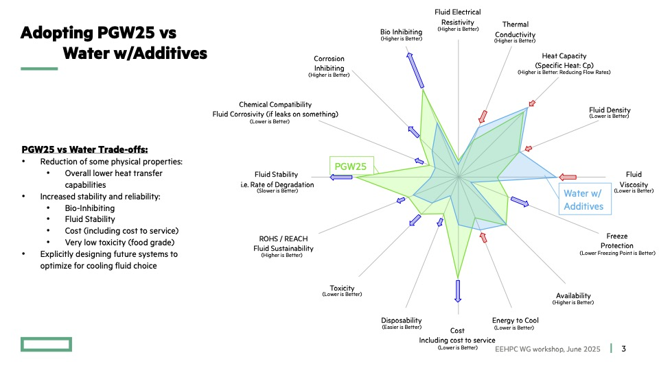

# Cooling and Thermal Management

## Content Overview
- The need for cooling - Power and Inefficiency!
- Types of cooling - Air, liquid, immersion, mechanical, evaporative, etc
- Heat reuse

## Relevant Media
- [Cooling Slides from HPE's Steve Dean and Torsten Wilde](PGW%20Cooling%20fluid%20figure%20of%20merit%20EEHPCWG%20HPE%20(Wilde).pdf)
- [SemiAnalysis Overview of DC Cooling](https://semianalysis.com/2025/02/13/datacenter-anatomy-part-2-cooling-systems/)(Must read)
- [LUMI Sustainability (2024)](https://www.bnl.gov/modsim/events/2024/files/talks/fredrik-robertsen.pdf) (Must read)
- [LUMI Design and Operation (2022)](https://moda.dmi.unibas.ch/wp-content/uploads/2022/07/moda22-slides-manninen.pdf)
- [Microsoft Microfluidic Cooling](https://news.microsoft.com/source/features/innovation/microfluidics-liquid-cooling-ai-chips/)
- [Cooling Lifecycle Analysis of Datacenters](https://www.nature.com/articles/s41586-025-08832-3)

## Activities
- Using data center diagrams, explain how heat is transferred from computing equipment to the external environment.

- Meme Coolant Proposal
    - Come up with an idea for a coolant (the fluid that helps transfer heat away from computing devices) that is both ridiculous but reasonably effective. Traditional coolants are so boring - like water, air, or special oils. What's a fluid from real-life (or from fiction) that is memeable yet not totally unusable. Hopefully this will be fun and help you consider critical elements of coolants that maybe you weren't aware of before.

    - To submit an entry, state the fluid and rank its properties from the below chart (from HPE) on a scale from 1 (worst) to 5 (best). Also rank the added property of memeability.

    

